# 優しいvim入門

---

🎉20卒の皆さんこんにちは🎉

>>>

軽くてっくらんちの説明を。。。

>>>

隔週でお昼にしているゆる〜い勉強会です👩‍💻

>>>

みなさんも是非いろいろお話ししてみてください！！！

---

## whoami

>>>

## whoami


>>>

## whoami

- 日下部拓人
- id:t-kusakabe
- 19新卒
- SREの下っ端もどき
- vimが好き
- 一言 : SAA取ります

>>>

新卒なので技術のことわかりません。  
マサカリは投げないでください。

---

今日はvimはいいぞ！という話をします。  
※ 使うことに専念します。  
※ 何か作ったりは特にしません。

>>>

ゴールはvim使ってみたいなと思っていただくこと！

---

# お断り

本スライドは、圧倒的主観であり戦争の引き金になりたい訳ではございませんのであらかじめご了承ください。

---

ところでみなさん、エディタは何を使われていますか？

>>>

vscode?

>>>

IDEA???

>>>

もっといいものを使いましょう！！！

---

# vim is 何？

>>>

[Vim Advent Calendar 2012](http://blog.supermomonga.com/articles/vim/startdash-with-mac.html) の記事

>>>

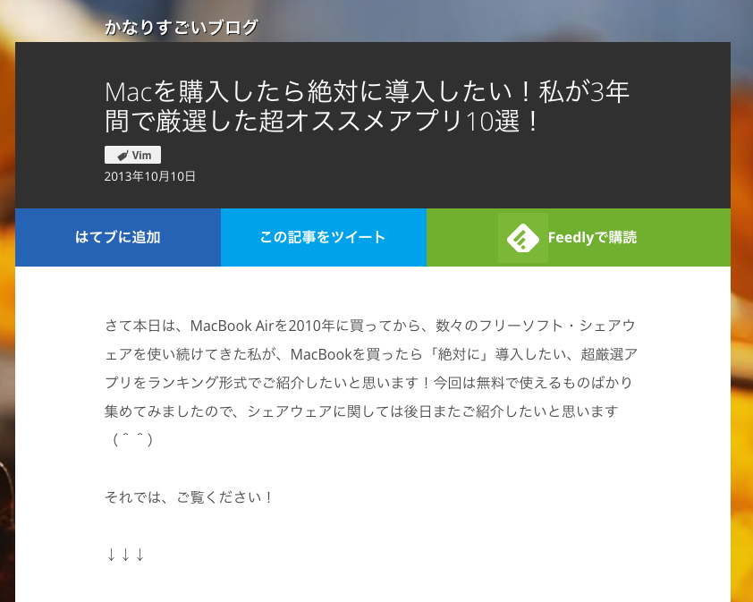

>>>

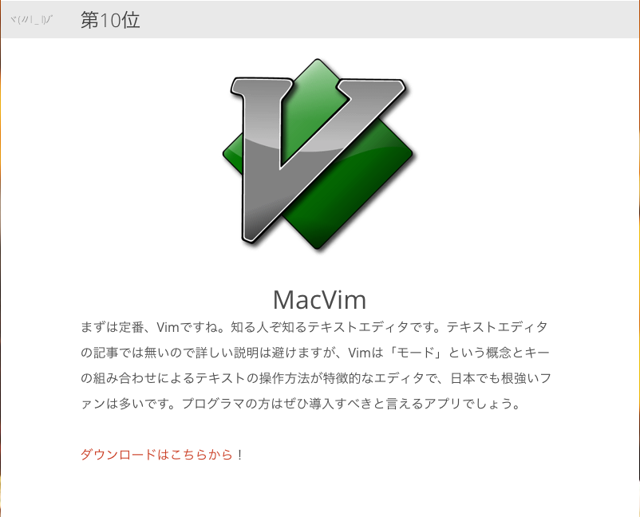

>>>

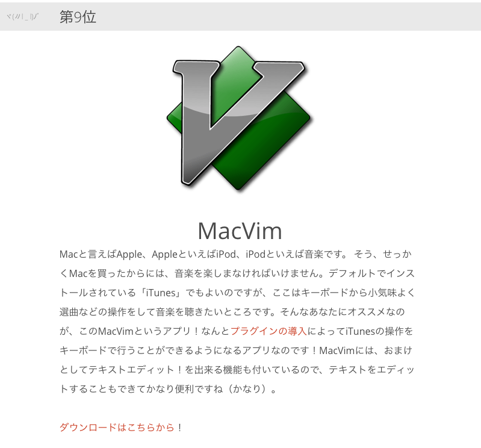

>>>

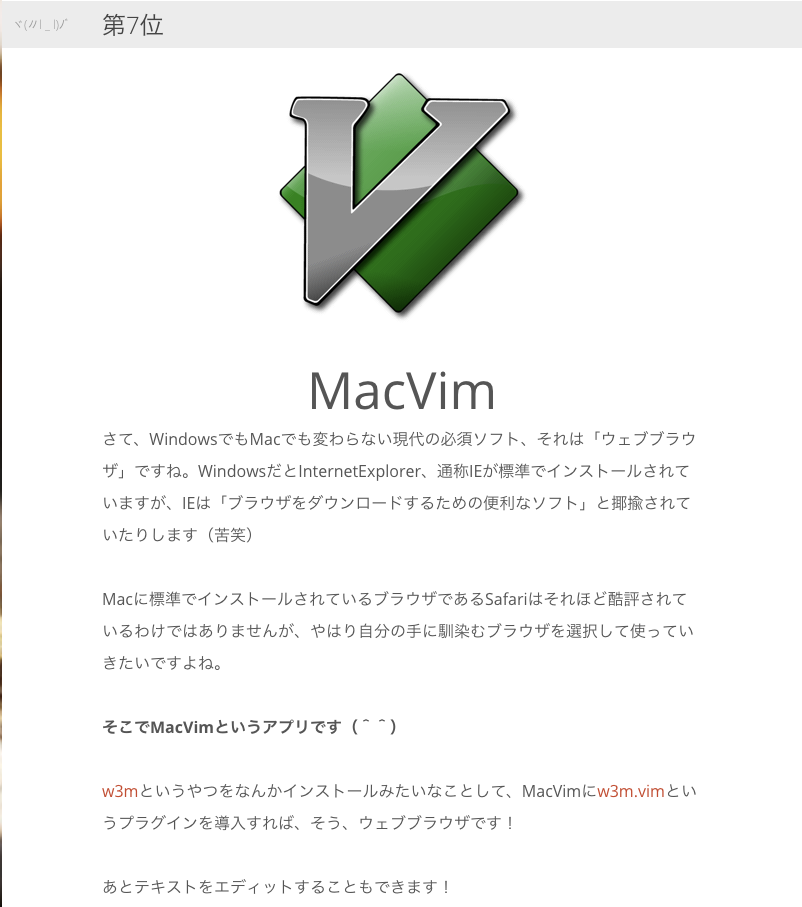

>>>

ちょっと飛んで

>>>

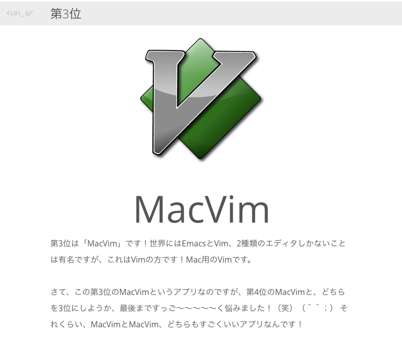

>>>

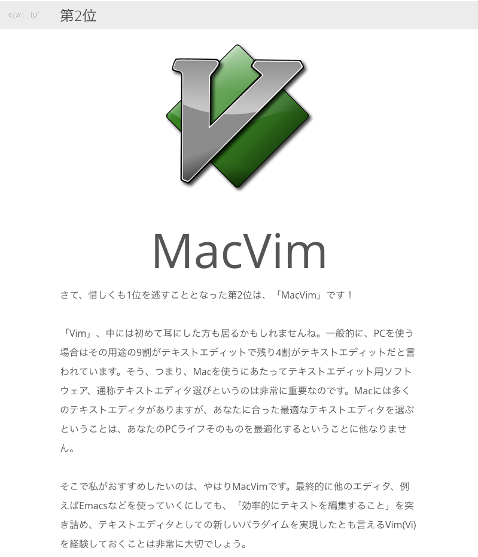

>>>

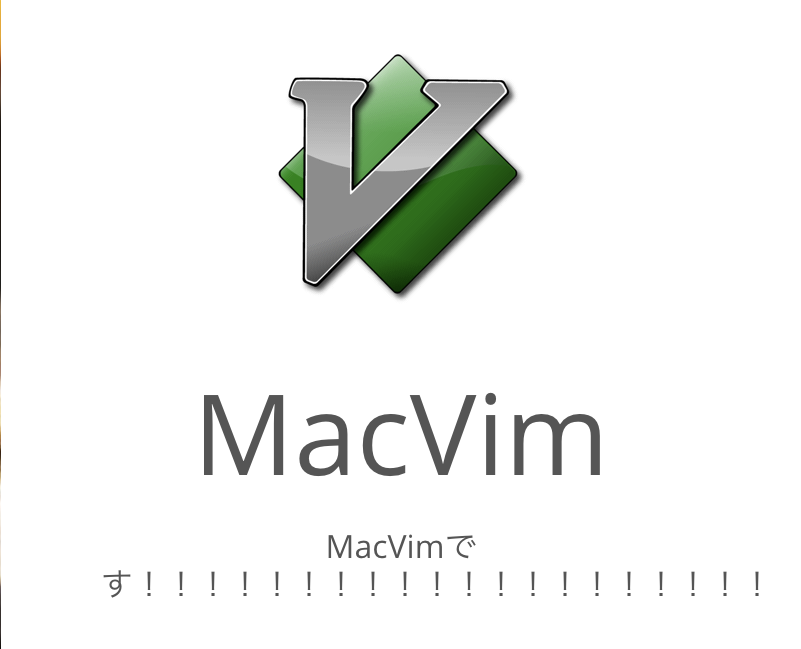

---

つまり。。。

---

# vim is 最強

vimで出来ないことはない。

>>>

とはいえ

>>>

やっぱり使い始めるまでに色々障壁がある。

>>>

今日はその障壁を突破していきましょう。

---

悩める先輩A

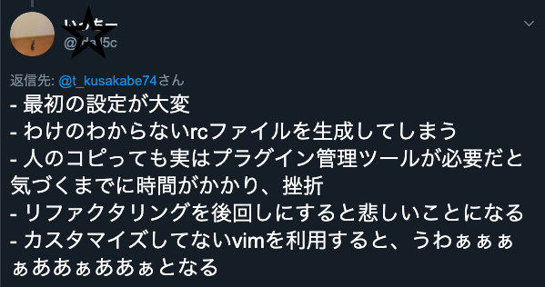

---

1つずつ見ていく。

---

最初の設定が大変

>>>

dotfileを作ろう！！！

>>>

dotfileとは。。。

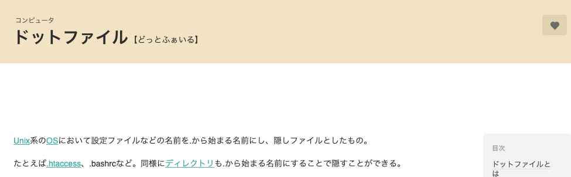

>>>

つまり.vimrcを作ってdotfileに含めておけば大変なのは最初の一回だけ！

>>>

頑張って書きましょう。

---

わけのわからないrcファイルを生成してしまう

>>>

neovimを使おう！

>>>

実はvimといってもたくさん種類がある。

>>>

本家vimよりstarも多い


>>>

そしてneovimは.vimrcではなく、init.vim。

>>>

つまり、わけのわからないrcファイルが生成されない！！！w

---

人のコピっても実はプラグイン管理ツールが必要だと気づくまでに時間がかかり、挫折

>>>

今日この勉強会で解決しましょう💪

---

リファクタリングを後回しにすると悲しいことになる

>>>

定期的に見直す時間は必要。。。

>>>

zc-vimを作りませんか？？？

---

カスタマイズしてないvimを利用すると、うわぁぁぁぁああぁああぁとなる

>>>

わかる。

---

なのでみんなでvimを使いましょう！！！

---

# vim選び編

---

いろんなvimがある。

>>>

macvim


>>>

- いわゆるgui vim
- cliが苦菜人には嬉しいかもしれない
- OS Xならbrew installで入る

>>>

onivim

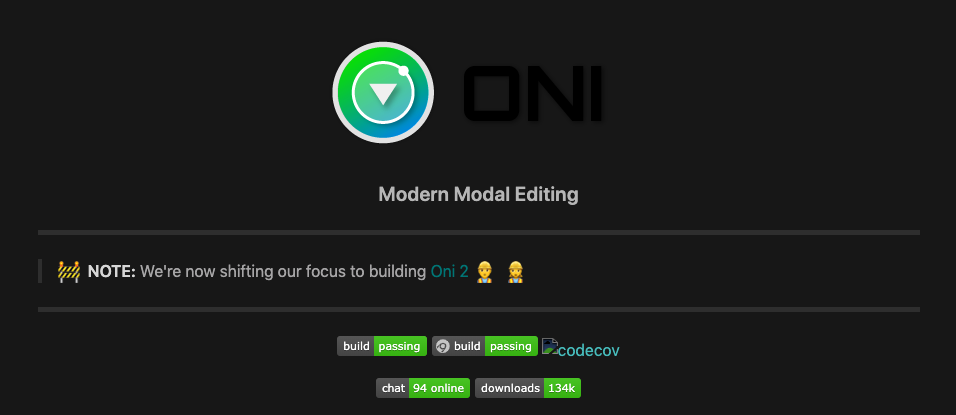

>>>

- vscode likeなvim
- neovimをguiにしたもの
- vscode愛用者には嬉しいかもしれない

>>>

neovim

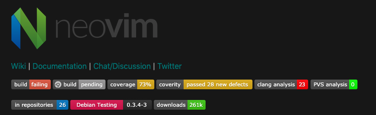

>>>

- 平たく言うとvimでは成し得なかったことをするために生まれたもの
- 非同期処理をやりやすくしたかったりする

---

僕はneovimを使っているので、neovimの想定で話をしていきます。(以降nvim)  
※ 基本的にはそんなに違いはありません。

---

# vim操作編

---

きっとみなさんが一番挫折するポイント。

>>>

とはいえ普通に使う分にはそんなに覚えることはない！

>>>

vimにはいろいろModeがある

>>>


`i` と `esc` で入力とコマンドModeを切り替える

>>>

移動は `h`, `j`,`k`,`l`

>>>

保存は `:w`

>>>

これだけ覚えておけば今日からでもvimで作業ができます！

---

# vim plugin編

>>>

vimのいいところはカスタマイズ出来るところ。

>>>

まずはpluginを管理しやすい基盤を作る。

>>>

- Vundle
- vim-plug
- NeoBundle
- dein.vim

>>>

今回はvim-plugを使います。

>>>

```
call plug#begin()

# 入れたいplugin
Plug 'cocopon/iceberg.vim'

call plug#end()
```

>>>

たったこれだけ！

>>>

あとは好きなpluginを書いていくだけです。

>>>

ちなみに僕の構成はこんな感じです。

```
.
├── colors
│   └── iceberg.vim
├── ftplugin
│   ├── dart.vim
│   ├── go.vim
│   ├── php.vim
│   ├── pug.vim
│   ├── ruby.vim
│   └── yaml.vim
├── init.vim
└── userautoload
    ├── basic.vim
    ├── plug.vim
    └── statusline.vim
```

---

# おすすめplugin編

>>>

vimの使いやすさはカスタマイズ度合いで決まる。

>>>

便利なpluginをフル活用しましょう！

---

fzf


>>>

- golang製
- cliでインクリメンタルな曖昧検索ができる
- pecoみたいなやつ

>>>

これをvimと組み合わせると。。。

>>>

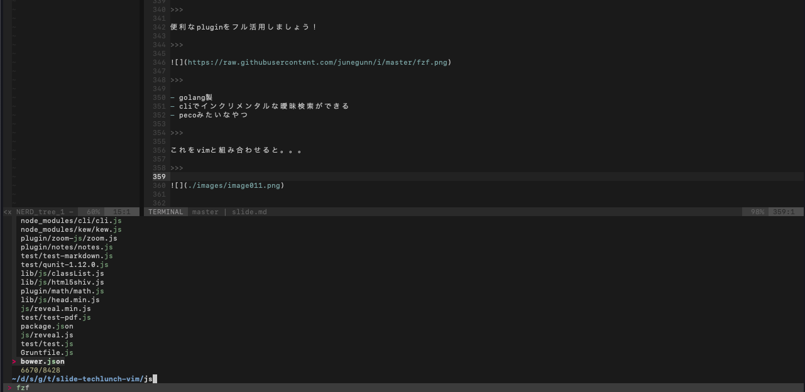

>>>

高速にfile検索が出来る！

>>>

vscode等の `cmd + p` 相当のことが高速にできる。

>>>

beffuerを使うより早いのでは。。。？

---

coc.nvim

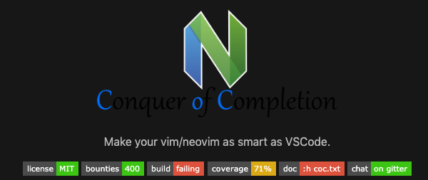

>>>

vimの補完は永遠の課題。。。

>>>

coc.nvimはそこそこいい感じの解決策な気がしています。

>>>

Make your vim/neovim as smart as VSCode.

>>>

js周りは、まじでvscodeくらいの補完ができる

---

iceberg.vim


>>>

エディタにとって見た目はとても大事

>>>


>>>

icebergを使えばとりあえずそれっぽくなります。

---

この辺りは無限に話せるのでおすすめ、気になるpluginがあれば教えてください。

---

# お知らせ

---

隔週でやる予定だったてっくらんちが毎週になるみたいです🤔

>>>

ルールとしては、発表者が2週間後の発表者を決める、というのは変わっていないです。

>>>

次回は西口さんの怖いtwilio勉強会！！！

>>>

- 現状のTwilioのプロダクト(赤電話)に何がどう活かせるか
- 今後のTwilio以外も含めた、WebRTC界隈の流れの予想
- 海外カンファレンス参加で得られたものと感想

>>>

再来週は、草間さんの怖いkubernetes！！！

>>>

きっと恐ろしい話が聞けると思います👀

---

質問タイム

